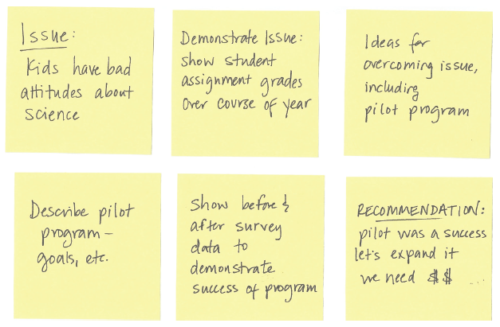

# 01 - The Importance of Context

> This may sound counterintuitive, but success in data visualization does not start with data visualization. Rather, before you begin down the path of creating a data visualization or communication, attention and time should be paid to **understanding the context for the need to communicate**. In this chapter, we will focus on understanding the important components of context and discuss some strategies to help set you up for success when it comes to communicating visually with data.

> When it comes to explanatory analysis, being able to concisely articulate exactly who you want to communicate to and what you want to convey before you start to build content reduces iterations and helps ensure that the communication you build meets the intended purpose. Understanding and employing concepts like the 3-minute story, the Big Idea, and storyboarding will enable you to clearly and succinctly tell your story and identify the desired flow.

## Exploratory vs. Explanatory Analysis

**Exploratory analysis** is what you do to understand the data and figur out what might be noteworthy or interesting to highlight to others. When we do exploratory analysis, it’s like hunting for pearls in oysters. We might have to open 100 oysters (test 100 different hypotheses or look at the data in 100 different ways) to find perhaps two pearls. When we’re at the point of communicating our analysis to our audience, we really want to be in the **explanatory** space, meaning you have a specific thing you want to explain, a specific story you want to tell—probably about those two pearls.

After undertaking an entire analysis, it can be tempting to want to show your audience everything, as evidence of all of the work you did and the robustness of the analysis. Resist this urge. You are making your audience reopen all of the oysters! **Concentrate on the pearls, the information your audience needs to know.**

## Context - Who, What, How

### Who:

*identify the common ground to ensure they hear your message*

- **Your audience**: Who your audience is?
  - **Avoid general audiences.** By trying to communicate to too many different people with disparate needs at once, you put yourself in a position where you can’t communicate to any one of them as effectively as you could if you narrowed your target audience.
  - **Identifying the decision maker** is one way of narrowing your audience. The more you know about your audience, the better positioned you’ll be to understand how to resonate with them and form a communication that will meet their needs and yours.
- **You**: How do your audience perceive you?
  - **Your relationship with your audience.** Think about how you expect that they will perceive you. Will you be encountering each other for the *first time* through this communication, or do you have an *established relationship*? Do they already *trust you as an expert*, or do you *need to work to establish credibility*?
  - This helps to determine *how to structure your communication* and *whether and when to use data*, and may impact *the order and flow of the overall story* you aim to tell.

### What

- **Action**: What you want your audience to know or do?
  - **You should always want your audience to know or do something.** If you can’t concisely articulate that, you should revisit whether you need to communicate in the first place. Think through how to make what you communicate relevant for your audience; form a clear understanding of why they should care about what you say.
  - **You are a subject matter expert**. Don't assume that the audience knows better. If you are the one analyzing and communicating the date, you likely know it best.
  - When it really isn’t appropriate to recommend an action explicitly, **encourage discussion** toward one. **Suggesting possible next steps** can be a great way to get the conversation going because it **gives your audience something to react** to rather than starting with a blank slate.
- **Mechanism**: Your method of communication.
  - Think of the communication mechanism along a continuum: How much control you have over how your audience consumes the information? How much details is needed?
  - **Live presentation**: high level of control, low level of details needed
  - **Written document/email**: low level of control, high level of details needed
  - **Slideument**: In reality (due to time and other constraints), it is often the same product that is created to try to meet both of these needs. This gives rise to the slideument, a single document that’s meant to solve both of these needs.
- **Tone**: What tone do you want your communication to set?
  - Are you celebrating a success? Trying to light a fire to drive action? Is the topic lighthearted or serious?
  - The tone you desire for your communication will have implications on the **design choices** that we will discuss in future chapters 

### How

Only after we can clearly articulate who our audience is and what we need them to know or do, we can turn to the data and ask the question: **What data is available that will help make my point?** Data becomes **supporting evidence of the story** you will build and tell. We’ll discuss much more on how to present this data visually in subsequent chapters.

> :bulb: **Non-suppporting Data**: Beyond being misleading by painting a one-sided story, showing only the data that backs up your point and ignoring the rest is very risky. A discerning audience will poke holes in a story that doesn’t hold up or data that shows one aspect but ignores the rest. **The right amount of context and supporting and opposing data** will vary **depending on the situation, the level of trust you have with your audience, and other factors**.

| | Example |
| :--- | :--- |
| **Who** | *The budget committee that can approve funding for continuation of the summer learning program.* |
| **What** | *The summer learning program on science was a success; please approve budget of $X to continue.* |
| **How** | *Illustrate success with data collected through the survey conducted before and after the pilot program.* |

## Tools for Context

### Questions to Ask about Context

Often, the communication or deliverable you are creating is at the request of someone else: a client, a stakeholder, or your boss. This means you may not have all of the context and might need to consult with the requester to fully understand the situation. There is sometimes additional context in the head of this requester that they may assume is known or not think to say out loud.

Following are some questions you can use as you work to tease out this information. If you’re on the requesting side of the communication and asking your support team to build a communication, think about answering these questions for them up front:
  - What background information is relevant or essential?
  - Who is the audience or decision maker? What do we know about them?
  - What biases does our audience have that might make them supportive of or resistant to our message?
  - What data is available that would strengthen our case? Is our audience familiar with this data, or is it new?
  - Where are the risks: what factors could weaken our case and do we need to proactively address them?
  - **What would a successful outcome look like?**
  *Knowing what the desired outcome is before you start preparing the communication is critical for structuring it well.*
  - **If you only had a limited amount of time or a single sentence to tell your audience what they need to know, what would you say?**
  *Putting a significant constraint on the message (a short amount of time or a single sentence) can help you to boil the overall communication down to the single, most important message.*

### 3-Minute Story & Big Idea: *the gist of your story*

*Boil the “so-what” down to a paragraph and, ultimately, to a single, concise statement.*

> :smile: While it sounds easy, **being concise is often more challenging than being verbose**. Mathematician and philosopher Blaise Pascal recognized this in his native French, with a statement that translates roughly to “*I would have written a shorter letter, but I did not have the time*” (a sentiment often attributed to Mark Twain).

- **3-Minute Story**: If you had only three minutes to tell your audience what they need to know, what would you say?
- **Big Idea**: Boils the so-what down even further: to a single sentence.
  - Must articulate your unique point of view
  - Must convey what's at stake
  - Must be a complete sentence

| | Example |
| :--- | :--- |
| **3-minute story** | *A group of us in the science department were brainstorming about how to resolve an ongoing issue we have with incoming fourth-graders. It seems that when kids get to their firs science class, they come in with this attitude that it’s going to be difficult and they aren’t going to like it. It takes a good amount of time at the beginning of the school year to get beyond that. So we thought, what if we try to give kids exposure to science sooner? Can we influence their perception? We piloted a learning program last summer aimed at doing just that. We invited elementary school students and ended up with a large group of second- and third-graders. Our goal was to give them earlier exposure to science in hopes of forming positive perception. To test whether we were successful, we surveyed the students before and after the program. We found that, going into the program, the biggest segment of students, 40%, felt just “OK” about science, whereas after the program, most of these shifted into positive perceptions, with nearly 70% of total students expressing some level of interest toward science. We feel that this demonstrates the success of the program and that we should not only continue to offer it, but also to expand our reach with it going forward.* |
| **Big Idea** | *The pilot summer learning program was successful at improving students’ perceptions of science and, because of this success, we recommend continuing to offer it going forward; please approve our budget for this program.* |

When you’ve articulated your story this clearly and concisely, creating *content* :point_down: for your communication becomes much easier.

### Storyboarding: *planning your content*

The storyboard establishes a structure for your communication. It is a visual **outline of the content** you plan to create. When you can (and as makes sense), **get acceptance from your client or stakeholder at this step**. It will help ensure that what you’re planning is in line with the need.

**Don’t start with presentation software.** It is too easy to go into slide-generating mode without thinking about how the pieces fit together and end up with a massive presentation deck that says nothing effectively. Additionally, as we start creating content via our computer, something happens that causes us to form an attachment to it. This attachment can be such that, even if we know what we’ve created isn’t exactly on the mark or should be changed or eliminated, we are sometimes resistant to doing so because of the work we’ve already put in to get it to where it is.

Avoid this unnecessary attachment (and work!) by **starting low tech. Use a whiteboard, Post-it notes, or plain paper.** It’s much easier to put a line through an idea on a piece of paper or recycle a Post-it note without feeling the same sense of loss as when you cut something you’ve spent time creating with your computer. I like using Post-it notes when I storyboard because you can rearrange (and add and remove) the pieces easily to explore different narrative flows.

