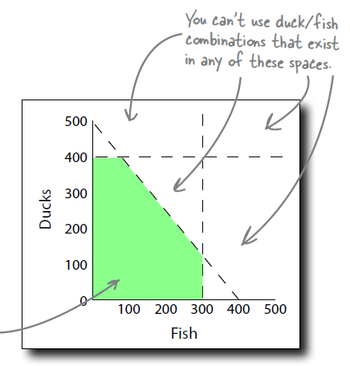

# 03 - Optimization: *Take It to the Max*

## Constraints vs. Decision Variables
- Outcome is influenced by many variables
- **Constraints** are the variables that we **cannot control**
- **Decision Variables** are those that we **can control**

## Optimization Problem & Objective Function
- **Optimization problem** is where you **try to get the most/least** possible outcome **by changing the values of decision variables**.
- Optimization problems are solved by **Objective Functions**.
  $$P = C_1 X_1 + C_2 X_2$$
  - where $P$ is the objective (max/min), $C$ is constraint, $X$ is decision variable
  - e.g., $Profit = Profit_{per Duck} * Count_{Duck} + Profit_{per Fish} * Count_{Fish}$
- **Feasible Region**
  - profit_per_duck = 5, profit_per_fish = 4; i.e., **P = 5 * duck_count + 4 * fish_count**
  - the time only allows us to make **duck_count <= 400, and fish_count <=300**
  - the rubber is also limited: **100 * duck_count + 125 * fish_count <= 50000**

## How Variables Relate to each other?
- **Don't assume variables are independent from each other**
- in this case, duck sales and fish sales are **negatively linked variables**

## Models & Assumptions
- **Useful, Reliable Model = Good Data + Accurate Assumptions**
- Assumptions should always be **explicit** and **based on an ever-changing reality**.
- For important analyses, state **all you know** and **all you don't know**.

> George Box
>> “All models are wrong, but some are useful.”
