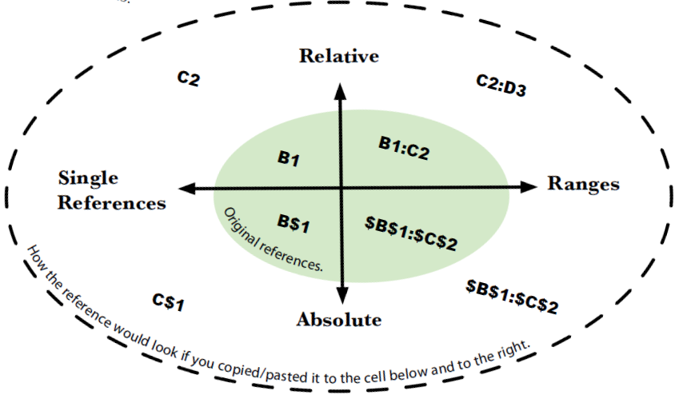

# 03 - References: *Point in the right direction*

> **A formula is only as good as its references.**

- :bulb: What I feel is ...
  - relative reference is like position-based indexing
    - `dataframe.iloc[where]`
  - named ranges are variables assigned with a reference
    - `variable_name = dataframe.iloc[where]`
  - structured refrences is based on a more elaborate lable-based indexing system (established when you create a Table)
    - `dataframe.loc[label_value]`

> Excel does have a syntax for pointing to ranges that exist on worksheets other than the worksheet where your function resides. e.g., `=MIN(worksheet2!D4:D19)` 
>> But a handy trick in writing formulas with arguments that involve cell ranges is to start writing a formula, getting to the argument of your function where you want to put the range but not typing anything: **Typing + Pointing**
>> A quick way to select **all** the numbers in column `D` for your `MIN` formula: you can type `MIN(LowBds!D:D)`. If there are other elements in the column, such as text or blank spaces, Excel will just ignore them.

:new: *Gross profit margin = (Revenue - Cost of sales) / Revenue*

## Relative vs. Absolute References
> The type of reference you’ll use will depend on your specific problem.

- **Relative references**, when copied and pasted, **shift in proportion to the original formula**.
- When you want a reference to **stay fixed no matter where you copy and paste it**, you need to use an **absolute reference**.
- Syntax to make a reference absolute: `$`
  - `$B2` If you put a dollar sign before the column, the row can shift;
  - `B$2` If you put one before the row, the column can shift;
  - `$B$2` If you use two dollar signs, the reference will stay totally fixed.

> If your references start to confuse you, you can turn to a powerful feature of Excel called named ranges....

#### Named Ranges (and cells)
- When you used named ranges, you can replace those references with a plain-language name of your choosing. Once you name your ranges, which by the way are **by definition absolute references**, you can drop them right into your formulas.
- To define names, select the cell/range, then either <kbd>right click</kbd> "Define Name" or type in the upper left "Name Box" (in front of the "Formula Bar")

> Names cells and ranges make your formulas easier to read. But going through a whole bunch of cells and ranges and naming them individually takes a lot of time, too!

> **Structured references are a different dimension of absolute reference**

## Structured References
- With a "Table", Excel provides lots of options, including **automatically generated range names**. In a "Table", a special syntax called **structured references** helps to simplify range names.

#### Create a Table
1. Select your data, then head over to the Insert taband click Table.
2. Change your table name from Table1 to something moremeaningful.
3. Use the table for structured references.
4. *You can select a different style under the Design tab.*

> Named ranges are simple absolute ranges, while structured references are much more versatile absolute ranges.

> Remember, references to named ranges and structured references never shift.

