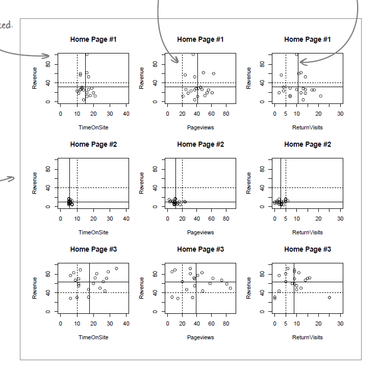

# 04 - Data Visualization: *Pictures Make You Smarter*

> Good data visualizations help to 
> **identify the fundamental comparisons**
> that **address/fulfill the client's objectives**.

## Features of Effective Visualization
- **Show the Data** (both the originals & summarizations)
- **Make Smart Comparisons** that address the objectives
- **Show Multiple Variables** (one way is to put graphs side by side)

## Scatterplot
- **exploratory data analysis**, searching for causal relationships (not to prove yet)
- x-axis for independent variable, y-axis for dependent variable

## It's always possible for more than one theories to fit the data.
- Should address **alternative causal models (hypotheses)** when describing the visualization.
- To **prove** the causal relationships, need more **controlled experiments**.

