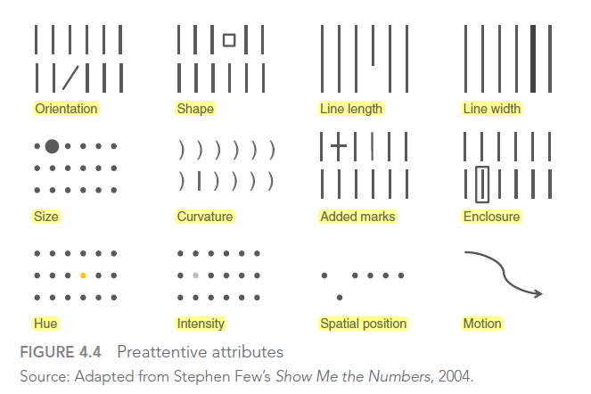
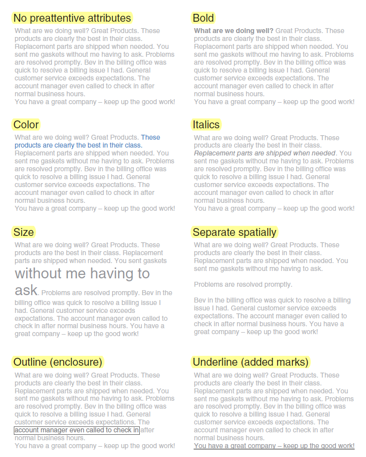

# 04 - Focus Your Audience’s Attention

> Preattentive arributes can help direct your audience's attention and create a visual hierarchy of elements to lead your audience through the information.

> Preattentive attributes are powerful tools when used sparingly and strategically in visual communication. Without other cues, our audience is left to process all of the information we put in front of them. Ease this by leveraging preattentive attributes like size, color, and position on page to signal what’s important. Use these strategic attributes to draw attention to where you want your audience to look and create visual hierarchy that helps guide your audience through the visual in the way you want. Evaluate the effectiveness of preattentive attributes in your visual by applying the “where are your eyes drawn?” test.

## Visual Processing & Memory

### How We See Stuff
1. **Light** reflects off of a **stimulus**
2. Captured by our **eyes** (some processing here)
3. In our **brain: visual perception** (more processing)

### Three Types of Memory

- **Iconic Memory**:
  Iconic memory is super ***fast***. It happens without you consciously realizing it and is piqued when we look at the world around us. These were ***survival*** mechanisms then; they can be leveraged for effective visual communication today. Information stays in your iconic memory for a fraction of a second before it gets forwarded on to your short-term memory. The important thing about iconic memory is that it is tuned to a set of ***preattentive*** attributes.
- **Stort-Term Memory**:
  Short-term memory has ***limitations***. Specifically, people can keep about four ***chunks*** of visual information in their short-term memory at a given time. Generally, we want to form larger, ***coherent*** chunks of information so that we can fit them into the finite space in our audience’s working memory.
- **Long-Term Memory**:
  When something leaves short-term memory, it either goes into oblivion and is likely lost forever, or is passed into long-term memory. Long-term memory is built up over a ***lifetime*** and is vitally important for ***pattern*** recognition and general ***cognitive*** processing. Long-term memory is the ***aggregate of visual and verbal memory***, which act differently. ***Verbal*** memory is accessed by a neural net, where the path becomes important for being able to recognize or recall. ***Visual*** memory, on the other hand, functions with specialized structures. :bulb: Images can help us more quickly recall things stored in our long-term verbal memory. By combining the visual and verbal, we set ourselves up for success when it comes to ***triggering*** the formation of long-term memories in our audience.

## Preattentive Arributes: *Signaling Where to Look*

When our iconic memory is being leveraged, our brain is quick to pick up on preattentive attribute (e.g., the intensity of color) without our having to dedicate any conscious thought to it. If we use preattentive attributes strategically, they can help us enable our audience to see what we want them to see before they even know they’re seeing it!

People tend to associate quantitative values with some (but not all) of the preattentive attributes. For example, most people will consider a long line to represent a greater value than a short line. That is one of the reasons bar charts are straightforward for us to read. But we don’t think of color in the same way. It tells us **which of the attributes can be used to encode quantitative information** (line length, spatial position, or to a more limited extent, line width, size, and intensity can be used to reflect relative value), and **which should be used as categorical differentiators**.

Used **sparingly**, preattentive attributes can be extremely useful for:
  1. drawing your audience’s **attention** quickly to where you want them to look;
  2. creating a **visual hierarchy** of information.

*both can be applied to text & graph* :point_down:

## Preattentive Arributes in Text

The **various attributes** draw our attention with differing strength. In addition, there are variances within a given preattentive attribute that will draw attention with more or less **strength** (e.g., bright blue > muted blue > light grey). We can leverage this variance and use **multiple preattentive attributes together** to make our visuals **scannable**, by **emphasizing** some components and **de-emphasizing** others.

Leveraging preattentive attributes to create a clear visual hierarchy of information establishes **implicit instructions** for your audience, indicating to them how to process the information. We can signal what is most important that they should pay attention to first, what is second most important that they should pay attention to next, and so on. We can push necessary but non-message-impacting components to the background so they don’t compete for attention. This makes it both easier and faster for our audience to take in the information that we provide.

## Preattentive Arributes in Graphs

:-1: During the **exploratory** phase: when you’re looking at the data to understand what might be interesting or noteworthy to communicate to someone else, avoid using any preattentive attribute. When you highlight one point in your story, it can actually make other points harder to see.

:+1: During the **explanatory** phase: when you want to share the information with audience, thoughtful use of preattentive attributes help focus the story. Especially in live presentation settings, **repeated iterations of the same visual, with different pieces emphasized** to tell different stories or different aspects of the same story.

> :bulb: In the process of determining where I want to focus my audience’s attention, one strategy I’ll often employ is to **start by pushing everything to the background**. This forces me to make explicit decisions regarding what to bring to the forefront or highlight.

### Size

Relative size denotes relative importance.

Don’t let your design choices be happenstance;
rather, they should be the result of explicit decisions.

### Color

Used sparingly, color is one the the most powerful tools to draw attention.

The use of color should always be an intentional decision. Never let your tool make this important decision for you.

> :bulb: I typically design my visuals in shades of grey and pick **a single bold color** to draw attention where I want it. My **base color is grey**, not black, to allow for **greater contrast** since color stands out more against grey than black.

Rules for using color:
- **Sparingly**
  Too much variety prevents anything from standing out. The power of the preattentive attributes was lost: everything was different, which meant that nothing stood out. A better alternative would be to use varying color ***saturation of a single color*** (a heatmap). Color Saturation also carries with it some quantitative assumptions (that more heavily saturated represents greater value than less or vice versa).
- **Consistently**
  Avoid novelty; use whatever will be easiest for your audience. The story you are telling should be what keeps your audience’s attention (we’ll talk about story more in Chapter 7), not the design elements of your graphs. Keep the same layout as you essentially train your audience how to read the information, making the interpretation of later graphs all the easier and reducing mental fatigue. A change in colors signals just that: a ***change***. So leverage this when you want your audience to feel change for some reason, but never simply for the sake of novelty. If you are designing your communication in shades of grey and using a single color to draw attention, leverage that same schematic throughout the communi cation. If you want to signal a clear change in topic or tone, a shift in color is one way to visually reinforce this.
- **Colorblindness**
  Roughly 8% of men (including my husband and a former boss) and half a percent of women are colorblind. This most frequently manifests itself as difficulty in distinguishing between shades of red and shades of green. In general, you should *avoid using shades of red and shades of green together*. When the ***conventional connotation*** should be used (e.g., red for loss, green for growth), additional visual cue to set the important numbers apart so you aren’t inadvertently disenfranchising part of your audience (e.g., use bold, varying saturation or brightness, or adding a simple plus or minus sign in front of the numbers).
  :bulb: `a recognizable alternative association`
  `blue for positive, orange for negative` 
- **Tone**
  Color evokes emotion. Consider the tone you want to set with your data visualization or broader communication and choose a color (or colors) that help reinforce the emotion you want to arouse from your audience. As with many of the other decisions we make when communicating with data, the audience (in this case, my client) should be kept top of mind and their needs and desires considered when making design choices like these.
- **Brand Color**
  Identify ***one or maybe two*** brand-appropriate colors to use as your “audience-look-here” cues and keep the rest of your color palette relatively muted with shades of grey or black.
  In some cases, it may make sense to ***deviate*** from brand colors entirely: e.g., it wasn’t attention grabbing enough; there wasn’t sufficient contrast. Just pick another color and make sure it doesn’t clash with the brand colors if they need to be shown together

### Position on Page

Without other visual cues, most members of your audience will start at the top left of your visual or slide and scan with their eyes in zigzag motions across the screen or page. They see the top of the page first, which makes this precious real estate. Think about putting the most important thing here.

Aim to work within the way your audience takes in information, not against it.

