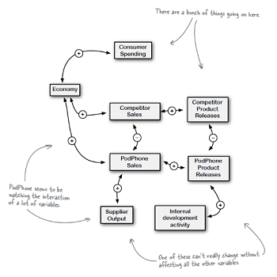

# 05 - Hypothesis Testing: *Say It Ain't So*

> **Never assume the obvious explanations to be TRUE**.

> The aspiration of good analysts is to
>> **undercover unintuitive answers to complex problems**.

- :bulb: What I feel is ..
  - each hypothesis is a model.
  - we use what we known (training data) to shape the model,
  - so the model surely fits the training data;
  - but much more is unknown than known,
  - so the model risks **overfitting** the training data.
  - when new evidence (data) is found,
  - we should update the training data and reconfigure the model.

## Data vs. Hypothesis

#### :no_entry: Don't "Satisfice"
Compare the data with your hypothesis: just because one hypothesis (model) **fits** the data (i.e., nothing in the evidence proves the model wrong) doesn't mean that the data (evidence) strongly **supports** the model.
- model **fits** data **≠** data **supports** the model
- hypothesis fits what is known ≠ real world supports the hypothesis

#### Variable Relationships -> Hypothesis
Data variables can be negatively/positively linked, such relationships help to develop a better model.

#### :bulb: Linearity is intuitive, but reality is complex.
Decisions need to be made in the context of an **active, volatile, interlinked** system.

> Given incomplete information, **picking the hypothesis based on what is known** can be dangerous: there might be **something important that is unknown**.

## Falsification
- Instead of picking a hypothesis that "best fits" the data, falsification eliminates the disconfirmed hypotheses.
- This ***overcomes the natural tendency to ignore alternative explanations***.
- Falsification helps to **aggregate heterogeneous data** of widely **varying quality**.
- When not all hypothesis could be falsified definitively, **use the evidences to rank hypothesis**.

#### Diagnostic Evidence
An evidence is diagnostic if it helps to rank one hypothesis as stronger than another.
- Evidence#1 is **diagnostic** if it ranks H2 more possible over H1;
- Evidence#2 is **not diagnostic** if it cannot distinguish whether H1 or H2 is more possible.

> New evidence can update your beliefs.
