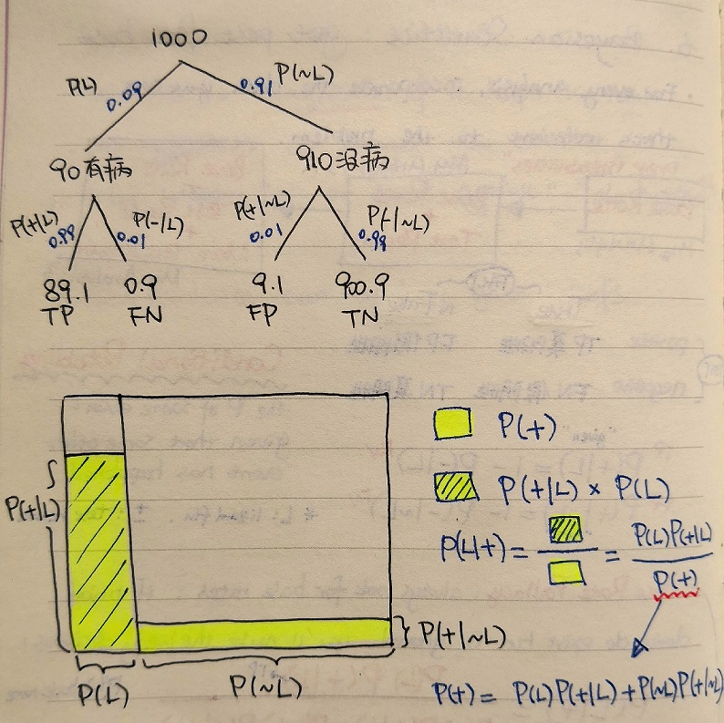

# 06 - Bayesian Statistics: *Get Past First Base*

> For every analysis, incorporate the data you already have that's relevant to the problem.

- Watch for **base rates** :exclamation:
- **Incorporate** them :exclamation:
- **Update** them :exclamation:

## Base Rate

| my analysis 1 | my analysis 2 | my analysis 3 |
| :---: | :---: | :---: |
| **Base Rate** | **Base Rate + Test Results** | **New Base Rate + More Test Results** |
| aka. the *prior probability* | *posterior probability* | *new posterior probability* |

### Base Rate Fallacy

Always look for base rates. If prior data do exist but is ignored, you'll make the wrong decisions.

Responding to the test result (or even the test accuracy statistics) without looking at base rates is a recipe for confusion.

## Confusion Matrix

| | Ill (fact) | Not Ill (fact) |
| ---: | :---: | :---: |
| **Positive (test)** | TP真阳性 | FP假阳性 |
| **Negative (test)** | FN假阴性 | TN真阴性 |

## Conditional Probability

:new: The **P**robability of some event, given that some other event has happened.

***L**: lizard flu fact, **+/-**: test result positive/negative*

$$P(+|L) = 1 - P(-|L)$$
$$P(+|\sim L) = 1 - P(-|\sim L)$$

*$P(+|L)$ is the probability of **True Positive**; $P(-|L)$ is the probablity of **False Negative**
$P(+|\sim L)$ is the probability of **False Positive**; $P(-|\sim L)$ is the probability of **True Negative***

## Bayes' Theorem

Bayes' rule provides a precise way of incorporating new information into your analyses.

*Given the new **+** (positive) test result, the probability of having **L**izard flu:*
$$P(L|+)=\frac{P(L)P(+|L)}{P(L)P(+|L) + P(\sim L)P(+|\sim L)}$$
or simplified as
$$P(L|+)=\frac{P(L)P(+|L)}{P(+)}$$
*where $P(+|L)$ is the probability of seeing the **+** (positive) test result, if having **L**izard flu is true;*
*$P(L)$ is the base rate: the probability of having **L**izard flu in the entire population*

