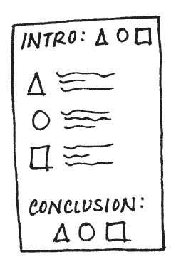

# 07 - Lessons in Storytelling

> Stories resonate and stick with us in ways that data alone cannot. In this chapter, I introduce concepts of storytelling that can be leveraged for communicating with data. We consider what can be learned from master storytellers. A story has a clear beginning, middle, and end; we discuss how this framework applies to and can be used when constructing business presentations. We cover strategies for effective storytelling, including the power of repetition, narrative flow, considerations with spoken and written narratives, and various tactics to ensure that our story comes across clearly in our communications.

> When we construct stories, we should do so with a beginning (plot), middle (twists), and end (call to action). Conflict and tension are key to grabbing and maintaining your audience’s attention. Another central component to story is the narrative, which we should consider in terms of both order (chronological or lead with ending) and manner (spoken, written, or a combination of the two). We can utilize the power of repetition to help our stories stick with our audience. Tactics such as horizontal and vertical logic, reverse storyboarding, and seeking a fresh perspective can be employed to help ensure that our stories come across clearly in our communications.

> The main character in every story we tell should be the same: our **audience**. It is by making our audience the protagonist that we can ensure the story is about them, not about us. By making the data we want to show **relevant** to our audience, it becomes a pivotal point in our story. No longer will you just show data. Rather, you will tell a story with data.

## The Magic of Story

Story is a time-tested structure; humans have been communicating with stories throughout history.

### Storytelling in Plays

The notion of narrative structure was first described in ancient times by Greek philosophers such as Aristotle and Plato. Aristotle introduced a basic but profound idea: that story has a clear beginning, middle, and end. He proposed a **three-act structure** for plays. This concept has been refined over time and is commonly referred to as the **setup, conflict, and resolution**.

1. **First act: sets up the story**
  characters, relationships, world, incident (first turning point) -> dramatic situation and dramatic question to be answered in the climax
2. **Second act: makes up the bulk of the story**
  attempt to resolve the problem, worse situations, character arc, major changes
3. **Third act: resolves the story and its subplots**
  climax, dramatic question answered, charaters' new sense of identity

First, the three-act structure can serve as a model for us when it comes to communicating in general. Second, that conflict and tension are an integral part of story.

### Storytelling in Cinema

Robert McKee, the author of *Story*. In an interview for *Harvard Business Review*, he discusses persuasion through storytelling and examines how storytelling can be leveraged in a business setting. McKee says there are **two ways to persuade people**:
  1. **Conventional rhetoric**
  It’s an ***intellectual*** process. But it is problematic, because while you’re trying to persuade your audience, they are arguing with you in their heads.
> “If you do succeed in persuading them, you’ve only done so on an intellectual basis. That’s not good enough, because people are not inspired to act by ***reason*** alone”
  2. **Story**
  Stories unite an idea with an ***emotion***, arousing the audience’s attention and energy. Because it requires creativity, telling a compelling story is harder than conventional rhetoric. But delving into your creative recesses is worth it because story allows you to ***engage*** your audience on an entirely new level.
> What exactly is story? At a fundamental level, a story expresses how and why life changes. Stories start with balance. Then something happens—an event that throws things out of balance. McKee describes this as “subjective expectation meets cruel reality.” This is that same tension we discussed in the context of plays. The resulting struggle, conflict, and suspense are critical components of the story.

We can use stories to engage our audience emotionally in a way that goes beyond what facts can do. More specifically, we can use the questions McKee outlines to identify stories to frame our communications.

### Storytelling in Written Words

:blush: Kurt Vonnegut's Tips from *How to Write with Style*
  1. **Find a subject you care about.**
    The most compelling and seductive element in your style is genuine caring, not your games with language.
  2. **Do not ramble, though**
    Ok, short and to the point.
  3. **Keep it simple.**
    Great masters wrote sentences which were almost childlike when their subjects were most profound.
  4. **Have the guts to cut.**
    If a sentence, no matter how excellent, does not illuminate your subject in some new and useful way, scratch it out.
  5. **Sound like yourself.**
    When I sound most like myself, I am most trusted by myself and others.
  6. **Say what you meant to say.**
    Follow the rules of punctuation and semantics?
  7. **Pity the readers.**
    Audience requires us to be sympathetic and patient teachers, ever willing to simplify and clarify.

Keep it simple.
Edit ruthlessly.
Be authentic.
Don’t communicate for yourself; communicate for your audience.
The story is not for you; the story is for them.

## Constructing the Story

Story is what ties together information, giving our presentation or communication a framework for our audience to follow.

We can use this idea of beginning, middle, and end—taking inspiration from the three-act structure—to set up the stories that we want to communicate with data.

### Beginning

The first thing to do is introduce the **plot**, building the context for your audience. We should involve our audience, piquing their interest and answering the questions that are likely on their mind: Why should I pay attention? What is in it for me?

Questions to address for setting up the story
Beyond Bullet Points* by Cliff Atkinson
  1. **Setting**: When and where does the story take place?
  2. **Main Character**: Who is driving the action? (This should be framed in terms of your audience!)
  3. **Imbalance**: Why is it necessary, what has changed?
  4. **Balance**: What do you want to see happen?
  5. **Solution**: How will you bring about the changes?

`imbalance-balance-solution` :point_down:
`problem & your recommended solution`

Frame your story in terms of their (your audience’s) problem so that they immediately have a stake in the solution.

### Middle

The bulk of your communication further develops *what could be*, with the goal of convincing your audience of the need for action. Retain your audience’s attention through this part of the story by addressing **how they can solve the problem** you introduced. Work to convince them **why they should accept the solution you are proposing** or act in the way you want them to.

The specific content will take different forms, e.g.,
  - relevant **background**
  - external **context** or **comparison** points
  - **examples** to illustrate the issue
  - **data** to demonstrate the problem
  - **what will happen if** no action is taken
  - **potential options** for addressing the problem
  - **benefits of your recommended solution**
  - why your **audience** is in a **unique position** to make a decision

When considering what to include in your communication, keep your audience top of mind. Think about what will resonate with them and motivate them. If you can identify **what motivates your audience**, consider framing your story and the need for action in terms of this. Also think about whether and when data will strengthen your story and integrate it as makes sense.

### End

End with a **call to action**: make it totally clear to your audience what you want them to do with the new understanding or knowledge that you’ve imparted to them. Tie it back to the beginning: restate the dramatic tension; reiterating any sense of urgency and sending your audience off ready to act.

## Narrative Structure

> :new: **Narrative**: words—written, spoken, or a combination of the two—that tell the story in an order that makes sense and convinces the audience why it’s important or interesting.

The most beautiful data visualization runs the risk of falling flat without a compelling narrative to go with it.

### Narrative Flow: the Order of Story

**Narrative flow** is the spoken and written path along which you take your audience over the course of your presentation or communication. This path should be clear to you. If it isn’t, there certainly isn’t a way to make it clear to your audience.

Are your audience busy? New or familiar audience? Care more about the process or just the answer? Is this a collaborative process where you need their input? Are you asking them to make a decision or to take an action?

| Chronologically | Lead with the Ending |
| :--- | :--- |
| One way to approach the communication of this to our audience is to follow that same path, taking the audience through it in the same way we experienced it. This approach can work well **if you need to establish credibility** with your audience, or **if you know they care about the process**. | Start with the call to action: what you need your audience to know or do. Then back up into the critical pieces of the story that support it. This approach can work well **if you’ve already established trust** with your audience **or you know they are more interested in the “so what”** and less interested in how you got there. |

### Spoken vs. Written Narrative

| Live Presentation | Written Report |
| :--- | :--- |
| Ensure what your audience needs to read on a given **slide** or section isn’t so dense or consuming that their attention is focusing on that instead of listening to you. Articulate clearly the **role** you want your audience to play and how your presentation is **structured**. | Make the **“so what”** of each slide or section clear. Getting **feedback** from someone not as familiar with the topic can be especially useful in this situation. |

## Power of Repetition

Important information is gradually transferred from short-term memory into longterm memory. The more the information is repeated or used, the more likely it is to eventually end up in long-term memory, or to be retained.

**Start** with an executive **summary** that outlines for your audience what you are going to cover, **then** you can provide the **detail** or main content of your presentation, and finally **end** with a **summary** slide or section that reviews the main points you covered.


If you’re the one preparing or giving the presentation or writing the report, this may feel redundant, since you’re already familiar with the content. But to your audience (who is not as close to the content) it feels nice.

```
Set Expectations ---> Provide Details ---> Recapitulate
```

## Tactics for Clarity

Help ensure that the story you’re telling in your communication comes across.
Applicable to presentation decks and sometimes written reports.

### Horizontal Logic

The idea behind horizontal logic is that you can read just the slide title of each slide throughout your deck and, together, these snippets tell the overarching story you want to communicate. It is important to have **action titles (not descriptive titles)** for this to work well.

One strategy is to have **an executive summary slide up front**, with each bullet corresponding to a subsequent slide title in the same order.

Checking for horizontal logic is one approach to test whether the story you want to tell is coming through clearly in your deck.

### Vertical Logic

Vertical logic means that **all information on a given slide is self-reinforcing**. The content reinforces the title and vice versa. The words reinforce the visual and vice versa. There isn’t any extraneous or unrelated information. Much of the time, the decision on what to eliminate or push to an appendix is as important (sometimes more so) as the decision on what to retain.

### Reverse Storyboarding

When you storyboard at the onset of building a communication, you craft the outline of the story you intend to tell. As the name implies, reverse storyboarding does the opposite. You **take the final communication, flip through it, and write down the main point from each page** (it’s a nice way to test your horizontal logic as well). The resulting list should look like the storyboard or outline for the story you want to tell. If it doesn’t, this can help you understand structurally where you might want to add, remove, or move pieces around to create the overall flow and structure for the story that you’re interested in conveying.

### a Fresh Perspective

Once you’ve crafted your communication, give it to a friend or colleague. It can be someone without any context (it’s actually helpful if it is someone without any context, because this puts them in a much closer position to your audience than you can be, given your intimate knowledge of the subject matter). Ask them to tell you what they pay attention to, what they think is important, and where they have questions. This will help you understand whether the communication you’ve crafted is telling the story you mean to tell or, in the case where it isn’t exactly, help you identify where to concentrate your iterations.

As we become subject matter experts in our space, it becomes impossible for us to take a step back and look at what we’ve created (whether a single graph or a full presentation) through our audience’s eyes. But that doesn’t mean you can’t see what they see. Leverage a friend or colleague for their fresh perspective. Help ensure that your communication hits the mark.

