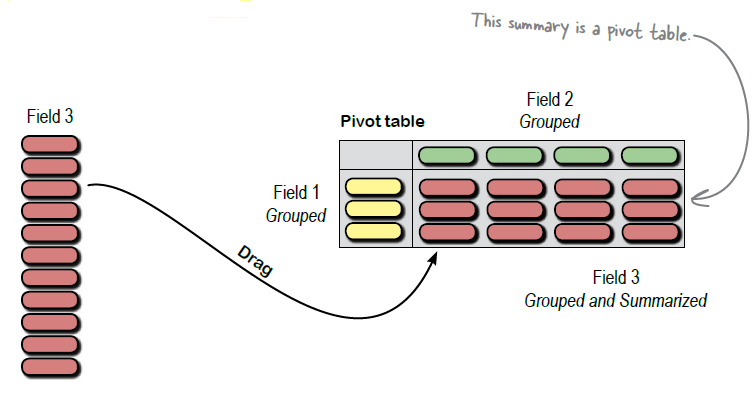
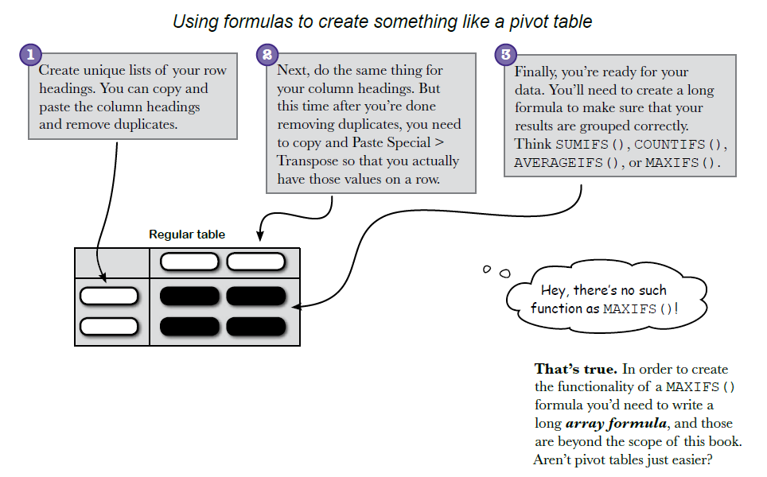

# 12 - Pivot Tables: *Hardcore Grouping*

> **Grouping (summarizing, slicing & dicing) made easy**
>> Their purpose is quite simple: to group data quickly so that you can analyze it. And as you're about to see, **grouping and summarizing** data using pivot tables is **much faster than** creating the same groupings **using formulas alone**.

## Why Pivot Tables?
#### For Repetitive Operations
- There is **complexity** in these data summaries that you've envisioned. You can slice the data in a million different ways, and it could take forever.
- But there's **simplicity** as well. These summaries basically have you doing the same sort of operation over and over again: applying formulas (e.g., `AVERAGE`, `MAX`/`MIN`, `COUNT`, `SUM`) to various groups and sub groups of data.
- How do you group data in a bunch of different ways and summarize the groupings with formulas? The best approach is to use Excel's pivot tables. Pivot tables are an extraordinarily powerful feature of Excel that let you quickly and visually run these operations.

#### To Pre-Visualize Where Your Fields Should Go
- Pivot tables are their own little universe inside Excel, and people get intimidated at first by all the options. The thing you need to remember is this: **stay focused on your analytical objectives**, and try to create tables that help you understand your data better.

## Hello, Pivot Tables
<mark>Insert</mark> -> <mark>Tables</mark> -> <mark>Pivot Table</mark>

- :bulb: Generally (but not always), your **rows and columns** will be **categories**, and your **data blank** will be the **numerical thing** you want to group and summarize by the row and column categories.

#### Filtering with Pivot Table
- Pivot tables have yet another dimension: filtering. Filters allow you to **take the elements you've assigned to your Values box and calculate only the ones that meet your criteria**. In this case, you want to look at average MPG only for cars with a reliability of 5.
- :question: Under your field’s settings, click <mark>Show values as…</mark> for some options to compare the data to other fields.

#### Pivot Charts
<mark>Insert</mark> -> <mark>Charts</mark> -> <mark>Pivot Charts</mark>

#### Formatting Pivot Tables
- Can we just format the pivot table directly as if it were a regular spreadsheet?
- You can, but a lot of people will copy and <mark>Paste Special</mark> -> <mark>Values</mark> the result of a pivot table to another sheet and then format the pasted results. The downside of that approach is that you lose your formulas. But the upside of the approach is that your formatting doesn’t mess up if you want to change your pivot table to look at another set of summaries.

## Faster Than Formulas

1. Create **unique lists of your row headings**. You can copy and paste the column headings and **remove duplicates**.
2. Next, do the same thing for your **column headings**. But this time after you’re done removing duplicates, you need to copy and **Paste Special -> Transpose** so that you actually have those values on a row.
3. Finally, you’re ready for your data. You’ll need to create a long formula to make sure that your results are grouped correctly. Think `SUMIFS()`, `COUNTIFS()`, `AVERAGEIFS()`, or `MAXIFS()`.
  3.1. There's no such function as `MAXIFS()`!
  3.2. That's true. In order to create `MAXIFS()` the functionality of a formula you’d need to write **a long array formula**, and those are beyond the scope of this book. Aren’t pivot tables just easier?
- Stay on the lookout for opportunities to use them. 
  - Chances are, if it's possible at all to do a task with pivot tables, doing that task with pivot tables is faster than the alternatives.

## "Pivoting" Explained
- You ***pivot*** the data when you **look at it from different angles**. One of the things that pivot tables enable you to do is switch around your data summaries really quickly, so if you wanted to "pivot" your rows and columns literally you'd be able to do it easily.
- How would I use pivot tables in a workflow for data analysis?
  - They are great for doing ***exploratory data analysis***, where you are looking at data from a bunch of different angles in order to **prepare your ideas for the use of more advanced data analysis techniques**.

#### `GETPIVOTDATA()`
- What about a little scrap of summary data rather than a full-blown table?
  - Even though you want a piece or two of data, you can still create a pivot table for it. Just be judicious in your use of grouping and filtering, and you can get the answers you need quickly.
- Anything like a pivot formula?
  - Check out the `GETPIVOTDATA()` function. You'll need to create a pivot table, but once you have it you can **call it from another worksheet using that function**.

> You can also **replicate a lot of the functionality of pivot tables using *structured references***. The more advanced structured reference syntax enables you to group data in ways you can't using conventional references. Yet another reason to deepen your skills as a formula master.

## On Analytic Power
- "There is nothing inside of Excel that matches Pivot Table's raw analytic power." BUT ***analytic power*** is essentially something the analyst brings to the game. The **user needs to be a good analyst** in order to use me to come up with good analytic results.
- You can insert as many levels of dimensionality into your pivot table analysis as you like. Dragging a whole mess of fields into a pivot table makes the resulting table full of fields, but if a user has the analytic chops for it, then creating such a table may be exactly what is in order.
- However, remember to ***keep things simple***. Even the most brilliant analyst is going to have to **present results to someone who isn't a brilliant analyst**, so keeping things simple for an audience’s sake is a good idea.

> Using pivot tables to access and **evaluate external data** (e.g., with OLAP) is one of the powerful uses of Excel.
