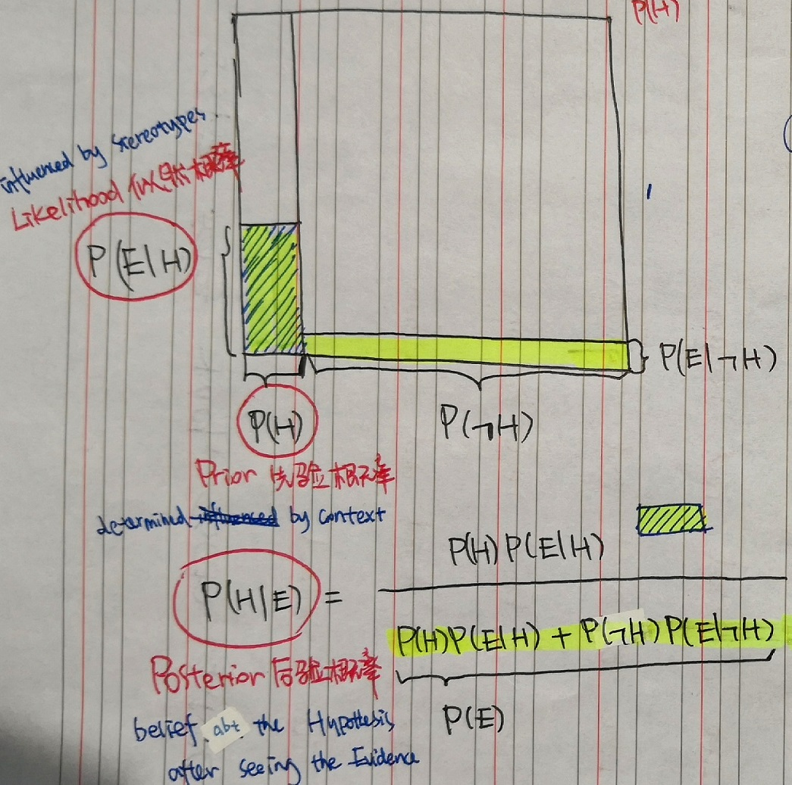
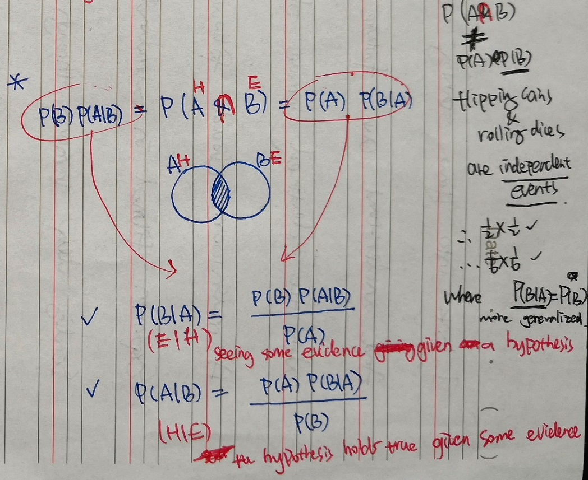

# Bayes' Theorem

## When is Bayes Useful?

Bayes' Theorem measures how much one variable **depends** on another.

:bulb: **New Evidence** should *not* determine beliefs in vacuum, but **update prior beliefs** (e.g., $P(H)$).

:bulb: **Rationality** is *not* about knowing **facts** (e.g., $P(H)$, $P(E)$), but recognizing which facts are **relevant**.
*Irrelevant evidence should not change beliefs.*

:question: Think about *probability* in terms of *proportion*?

## The Formula

*$P(H|E)$ **Posterior Probability** 后验概率,
is the belief about the hypothesis after seeing the new evidence.
i.e., Given the new **E**vidence, the **P**robability of the **H**ypothesis still holds true:*

$$P(H|E)=\frac{P(H)P(E|H)}{P(H)P(E|H) + P(\sim H)P(E|\sim H)}$$

or simplified as

$$P(H|E)=\frac{P(H)P(E|H)}{P(E)}$$

*$P(H)$, aka **Prior Probability** 先验概率,
is the **base rate**: the probability of the **H**ypothesis holds true in the entire population.
Prior Probability is determined by **context**.*

*$P(E|H)$, aka **Likelihood** 似然概率,
is the probability of seeing the **E**vidence, if the **H**ypothesis is true.
Likelihood is influenced by **stereotypes**.*

## Explained with Area

## Why is it so Calculated?

